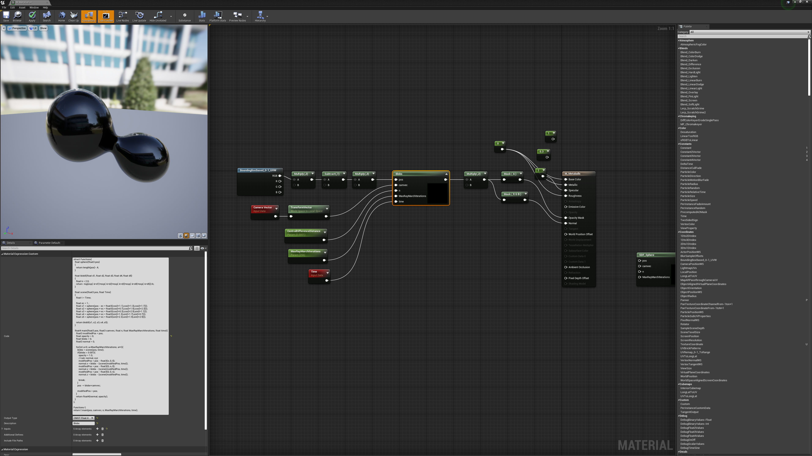

# Unreal_Metaballs
 My first try at implementing a raymarching shader in Unreal based on [this custom material](https://gumroad.com/l/Mandelbulb) by Kristof Lovas. As can be seen in the screenshot below, what is particularly interesting in his implementation is that it calculates the normal value of each pixel and thus you are able to utilize Unreal's lighting/shading efficiently.
 
